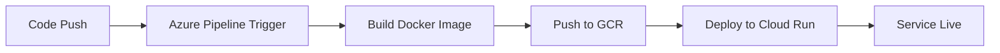

# Laboratorio: CI/CD con Azure Pipelines y Google Cloud Run

## 🎯 Objetivo
Crear una canalización de CI/CD que automáticamente construya y despliegue una aplicación PHP a Google Cloud Run usando Azure DevOps Pipelines.

## 📋 Prerequisitos

### Azure DevOps
- [ ] Cuenta de Azure DevOps
- [ ] Proyecto de Azure DevOps creado
- [ ] Repositorio Git configurado

### Google Cloud Platform
- [ ] Proyecto de GCP activo
- [ ] APIs habilitadas:
  - Cloud Run API
  - Container Registry API
  - Cloud Build API
- [ ] Service Account con permisos

## 🚀 Pasos de Configuración

### 1. **Crear Proyecto en Azure DevOps**

1. Ve a [Azure DevOps](https://dev.azure.com)
2. Crea una nueva organización (si no tienes una)
3. Crea un nuevo proyecto:
   ```
   Nombre: gcp-cloud-run-cicd
   Visibilidad: Private
   Version control: Git
   Work item process: Agile
   ```

### 2. **Configurar Service Account en GCP**

```bash
# Crear Service Account
gcloud iam service-accounts create azure-pipelines-sa \
    --display-name="Azure Pipelines Service Account"

# Asignar roles necesarios
gcloud projects add-iam-policy-binding [PROJECT-ID] \
    --member="serviceAccount:azure-pipelines-sa@[PROJECT-ID].iam.gserviceaccount.com" \
    --role="roles/run.admin"

gcloud projects add-iam-policy-binding [PROJECT-ID] \
    --member="serviceAccount:azure-pipelines-sa@[PROJECT-ID].iam.gserviceaccount.com" \
    --role="roles/storage.admin"

gcloud projects add-iam-policy-binding [PROJECT-ID] \
    --member="serviceAccount:azure-pipelines-sa@[PROJECT-ID].iam.gserviceaccount.com" \
    --role="roles/iam.serviceAccountUser"

# Crear clave del Service Account
gcloud iam service-accounts keys create azure-pipelines-key.json \
    --iam-account=azure-pipelines-sa@[PROJECT-ID].iam.gserviceaccount.com
```

### 3. **Configurar Variables en Azure Pipelines**

En Azure DevOps > Pipelines > Library > Variable groups:

```yaml
Variable Group: "gcp-connection"
Variables:
- GCP_PROJECT_ID: "tu-project-id"
- GCP_SERVICE_ACCOUNT_KEY: "[contenido-del-archivo-json-en-base64]"
```

**Para obtener la clave en base64:**
```bash
cat azure-pipelines-key.json | base64 -w 0
```

### 4. **Configurar Repository**

1. En Azure DevOps, ve a Repos
2. Clona el repositorio a tu máquina local
3. Copia todos los archivos de este proyecto al repositorio
4. Haz commit y push:

```bash
git add .
git commit -m "Initial CI/CD setup for Cloud Run"
git push origin main
```

### 5. **Crear Pipeline en Azure DevOps**

1. Ve a Pipelines > Pipelines
2. Click "New pipeline"
3. Selecciona "Azure Repos Git"
4. Selecciona tu repositorio
5. Selecciona "Existing Azure Pipelines YAML file"
6. Selecciona `/azure-pipelines.yml`
7. Click "Run"

### 6. **Configurar Service Connection (Opcional)**

Para una configuración más avanzada:

1. Ve a Project Settings > Service connections
2. Click "New service connection"
3. Selecciona "Docker Registry"
4. Configura:
   ```
   Docker Registry: https://gcr.io
   Docker ID: _json_key
   Password: [contenido del JSON del service account]
   Service connection name: gcr-connection
   ```

## 🔧 Archivos del Proyecto

### `azure-pipelines.yml`
- Pipeline principal de CI/CD
- Construye imagen Docker
- Pushea a Google Container Registry
- Despliega a Cloud Run

### `Dockerfile`
- Configuración de contenedor PHP
- Basado en imagen oficial de PHP/Apache
- Optimizado para Cloud Run

### `index.php`
- Aplicación PHP simple
- Responde a requests HTTP
- Configurable via variables de entorno

## 📊 Monitoreo del Pipeline

### En Azure DevOps:
- **Pipelines**: Ver status de builds
- **Builds**: Historial de ejecuciones
- **Releases**: Despliegues exitosos
- **Tests**: Resultados de pruebas

### En Google Cloud Console:
- **Cloud Run**: Servicio desplegado
- **Container Registry**: Imágenes almacenadas
- **Cloud Build**: Logs de construcción
- **Logging**: Logs de aplicación

## 🔄 Flujo de CI/CD



1. **Trigger**: Push a branch `main`
2. **Build**: Construir imagen Docker
3. **Test**: Ejecutar pruebas (opcional)
4. **Push**: Subir imagen a Container Registry
5. **Deploy**: Desplegar a Cloud Run
6. **Verify**: Verificar despliegue exitoso

## 🛠️ Solución de Problemas

### Error de Autenticación
```bash
# Verificar permisos del service account
gcloud projects get-iam-policy [PROJECT-ID] \
    --flatten="bindings[].members" \
    --filter="bindings.members:azure-pipelines-sa@[PROJECT-ID].iam.gserviceaccount.com"
```

### Error de Docker Push
```bash
# Verificar configuración de Docker
gcloud auth configure-docker
```

### Error de Cloud Run Deploy
```bash
# Verificar que la API esté habilitada
gcloud services list --enabled | grep run
```

## 📈 Métricas y Alertas

### KPIs de Pipeline:
- ⏱️ Tiempo de build
- ✅ Success rate
- 🔄 Frecuencia de deployments
- 🐛 Error rate

### Configurar Alertas:
```yaml
# En Azure DevOps > Project Settings > Notifications
- Build completion
- Deployment failure
- Build failure
```

## 🎓 Conceptos de DevOps Aplicados

1. **Continuous Integration**: Integración automática de código
2. **Continuous Deployment**: Despliegue automático a producción
3. **Infrastructure as Code**: Pipeline definido en YAML
4. **Containerization**: Aplicación empaquetada en Docker
5. **Cloud Native**: Despliegue en servicios serverless
6. **GitOps**: Pipeline activado por cambios en Git

## 📚 Referencias

- [Azure Pipelines Documentation](https://docs.microsoft.com/en-us/azure/devops/pipelines/)
- [Google Cloud Run](https://cloud.google.com/run/docs)
- [Container Registry](https://cloud.google.com/container-registry/docs)
- [Service Accounts](https://cloud.google.com/iam/docs/service-accounts) 